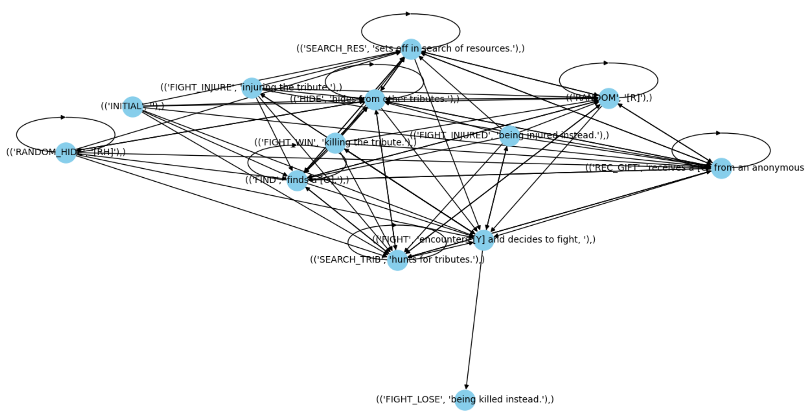

# Hunger Games Python Simulator

## Description
"Hunger Games Python Simulator" is a Python-based simulation game inspired by the popular Hunger Games books and films. The simulator **recreates the dynamics of the Games**, allowing players to design and watch a game unfold day after day. Using an interactive interface built with **Tkinter**, players can customize each game by choosing the number of participating districts (from 1 to 12) and assigning each tribute their own names and attributes, which influence their behavior in the arena.

Once setup is complete, the simulation begins, generating events for each day and night and displaying them through on-screen text. Every tribute will appear once every period, **with actions and outcomes driven by graph-based algorithms**. Each tribute’s actions are governed by a personalized probability graph, designed according to their attributes and past actions. The graph nodes determine the probabilities and potential actions a tribute might take next, aiming for realistic and dynamic interactions.

**This project showcases the powerful role of graphs in modeling complex behaviors and reducing the need for extensive conditional logic or manually programmed responses.**

## Table of Contents
- [Installation](#installation)
- [Usage](#usage)
- [Generation of Events](#generation-of-events)
- [How do Attributes and Events Affect the Graphs](#how-do-attributes-and-events-affect-the-graphs)
- [License](#license)
- [Contact](#contact)

## Installation
The only library that needs to be installed before running the program is "networkx":
```sh
pip install networkx
```
The version of Tkinter used to develop this simulator is 8.6.9.

## Usage
To execute this code, run "main.py" and the interface will open, ready to be used to setup the game and start the simulation.

## Generation of Events
This program **uses graph structures to determine all decisions made by the tributes** and to generate their actions dynamically. Two distinct graphs are used: one dedicated to the initial "Cornucopia Day" and another for all subsequent days and nights.

**Graph generation is based on CSV files** containing possible actions and their base probabilities. This approach allows for the design of highly complex and flexible graphs, which can be easily modified. Below is an example of one of the graphs generated:



**Each node represents an action to be taken and is connected by edges to other possible subsequent actions.** This improves the realism of the game as, for instance, a tribute has an increased chance of finding resources if they were actively searching in the previous turn.

Customizing tribute attributes is optional. Each tribute has 20 points that can be allocated across five traits: Resistance, Strength, Skills, Luck, and Charisma, each with a maximum level of 10.

If no attributes are customized, a tribute will follow a graph with standard probabilities. However, if traits are upgraded, **the graph is adjusted accordingly**, resulting in behavior that differs from other tributes.

Tributes may also suffer injuries or obtain resources, medicine, or weapons. **Each of these factors further influences their decision-making graphs.**

## How do Attributes and Events Affect the Graphs
As previously mentioned, **both traits and in-game events impact the decision graphs of the tributes**:

- **Resistance:** Resistance upgrades reduce the likelihood of a tribute dying from thirst, hunger, exhaustion, or losing control.

- **Strength:** Strength upgrades increase the chances of winning a battle against another tribute, either injuring or killing them. Stronger tributes also feel more confident and tend to seek out other tributes more frequently.

- **Skills:** Skills upgrades improve the probability of successfully searching for resources. With higher skill levels, a tribute is also less likely to experience accidents or engage in dangerous activities.

- **Charisma:** Charisma upgrades increase the likelihood of receiving gifts from sponsors. Tributes with high charisma are more likely to be spared by others, who may choose to injure rather than kill them.

- **Luck:** Luck upgrades enhance the chances of finding resources and reduce the risk of unexpectedly encountering other tributes. Only tributes with at least level 1 luck have the chance to find objects while hiding.

- **Injuries:** When injured, a tribute is less likely to win fights or actively seek out other tributes. If a tribute finds or receives a first aid kit while injured, they will recover, restoring their probabilities. If they already have a kit, they will heal instantly without changes in probability.

- **Weapons:** Tributes who find or receive a weapon are more likely to win fights and will seek out other tributes more frequently.

- **Resources:** Tributes with resources have an advantage in battles but tend to act more cautiously, reducing their likelihood of seeking out other tributes.

## License
This project is licensed under the **AGPL-3.0 License**. This means you are free to use, modify, and distribute this software, as long as any derivative work is also licensed under AGPL-3.0. This ensures that the same freedoms you receive are preserved for all users of the software.

## Contact
If necessary, contact the owner of this repository.